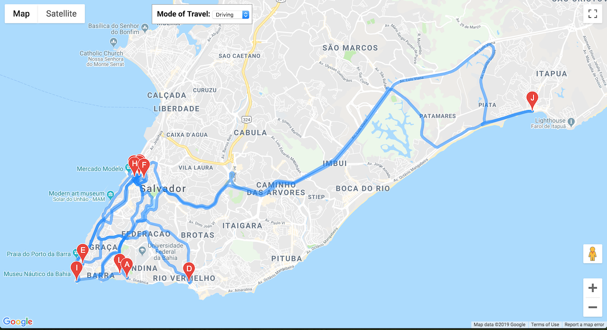
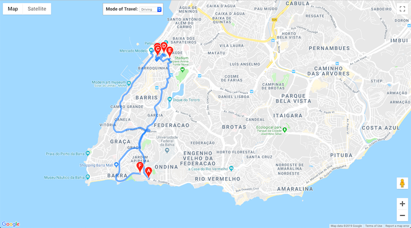

# Entrega 01

## Principais mudanças:

- Melhora na rota entre os poi's:

Foi adicionado parametro na requisição da API do Google Maps permitindo reordenamento dos poi's em busca da melhor rota entre os mesmos. No arquivo [map_sample.js](routes/map_sample.js) foi adicionado:

```
...
      optimizeWaypoints: true,
...
```

É possível ver como estava .
E como ficou 

- Menor número de pontos indicados em uma rota:

A primeira tentativa de diminuição dos pontos selecionava os pontos indicados mais próximos da localidade do usuário. No entanto esses pontos não necessáriamente geravam uma boa rota. Logo essa abordagem foi descartada.

Na segunda abordagem foi utilizado o conceito de clusterização, gerando assim clusters de pontos próximos e uma rota para cada conjunto de pontos. Logo ao invés do usuário ter apenas uma rota com varios pontos, são geradas três rotas com uma menor quantidade de poi's.

Arquivo com o algorítimo de clusterização [aqui](routes/clusterization.py)
Chamada do algorítimo de clusterização e divizão das rotas [aqui](routes/Route.py)

Rota única gerada 
Rotas geradas após clusterização primeira rota: , segunda rota:, terceira rota: 

## Mudanças secundarias

- Criação de pipelines diferentes para [criação dos dados](get_data.py) e [execução das recomendações](gen_recomen.py)
- Arquivo de [configuração](config.py) para variaveis globais utilizadas em diferentes locais.
- Arquivo com [dependências](requirements.txt) para facilitar criação de ambiente virtual
- Utilização de Jinja2 para criação de [template](routes/route_sample.html) facilitando passagem de parâmetros para o HTML 
