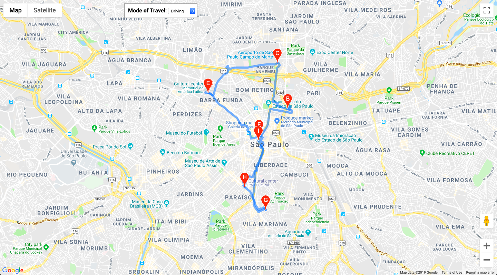

# Entrega 2

## Principais entregas

- Remover as localizações setadas HardCoded

Haviam localizações que eram passadas para a API do OSM, para a API do Google Maps que eram adicionadas diretamente ao código. Essas informações foram removidas e adicionadas a um arquivo de configuração. Isso permitiu que a taref a baixo pudesse ser realizada.
As mudanças foram feitas no arquivo de [geração de data](get_data.py), na [função de plotagem](routes/Route.py) dos pontos no google maps e em algumas das funções em JS responsáveis por renderizar o mapa.

- Gerar recomendações para outras localidades de Salvador:

Após remover as localizações fixas no código e transforma-las em variáveis foi possível gerar o resultado explicito abaixo, recomendação para um usuário em São Paulo:

Primeira rota: 
Segunda rota: 

No entanto foram encontrados probemas na geração das informações necessárias para recomendação em cidades grandes como São Paulo.
Por ser uma cidade que contem diversos POIs por diversas vezes as consultas à API do OSM não obtinham sucesso devido a um rate limit.

Após algumas pesquisas foi constatado que esse é um problema comum para aplicações que necessitam realizar diversas requisições à API do OSM.
Na tentativa de mitigar esse problema foram removidas algumas categorias a serem processadas e adicionado try catch com sleep e uma retentativa de de request [aqui](routes/OverlayData.py)

Uma outra possível solução para o problema foi cogitada, a utilização de cache. No entanto essa abordagem seria melhor para o sistema em produção no qual diversas solicitações iguais seriam feitas.

- Utilizar outras localizações para gerar reviews que ajudassem na recomendação de uma area:

A priori a tentativa era de utilizar os reviews de outras localidades do Brasil para gerar as recomendações de uma cidade.
Para isso seria feito o request de POIs, usuários e reviews do Brasil e da cidade de localização do usário. 
Assim na criação da recomendação seriam passados os reviews do Brasil e na recomendação seria gerada apenas para os items da cidade, como mostra ser possível na [documentação do GraphLab](https://turi.com/products/create/docs/generated/graphlab.recommender.item_similarity_recommender.ItemSimilarityRecommender.recommend.html#graphlab.recommender.item_similarity_recommender.ItemSimilarityRecommender.recommend)

Passando 'itens' para a função .recommend()

```
    items: Restricts the items from which recommendations can be made
``` 

No entanto dois fatores foram impedimento:

1. A geração das informações para varias cidades do Brasil se mostrou extremamente custosa e ineficiente.
2. Passando o Brasil inteiro como area para aquisição dos POIs era extremamente provável atingir o limite de resposta da api do OSM não havendo garantia que os POIs da cidade a ser recomendada estivesse dentre os POIs retornados para a area do Brasil.

## Próximos passos

- Melhorar a escolha de qual categorias buscar através de informações do usuário

Para que não seja necessário realizar as querys para todas as categorias, utilizar as informações de categorias dos lugares mais visitados pelo usuário em questão para determinar quais categorias deverão entrar na execução das querys.
O login do usuário será obtido através [dessa](https://developers.google.com/gmail/api/auth/web-server) api do Google e obter informações de id para buscas [dessa](https://developers.google.com/admin-sdk/directory/v1/guides/manage-users#get_user) forma.

- Uma tela na qual o usuário poderá fazer login e entrar com sua localização.

- Analizar o Precision and Recall após tais mudanças

Apresentar analize dos resultados atuais comparados aos resultados obtidos após as mudanças no fluxo de recomendações e se as mesmas foram de certa forma efetivas.

- Analisar possibilidade de uso de Search e Serendipity

Após disponível a geração da recomendação para qualquer lugar foi observado que uma recomendação gerada para um bairro poderia não ter insumo suficiente dentre as categorias selecionadas para gerar a recomendação da forma que está implementada.
O Serendipity, permite que o resultado de uma busca possa retornar sugestões de outros itens.


