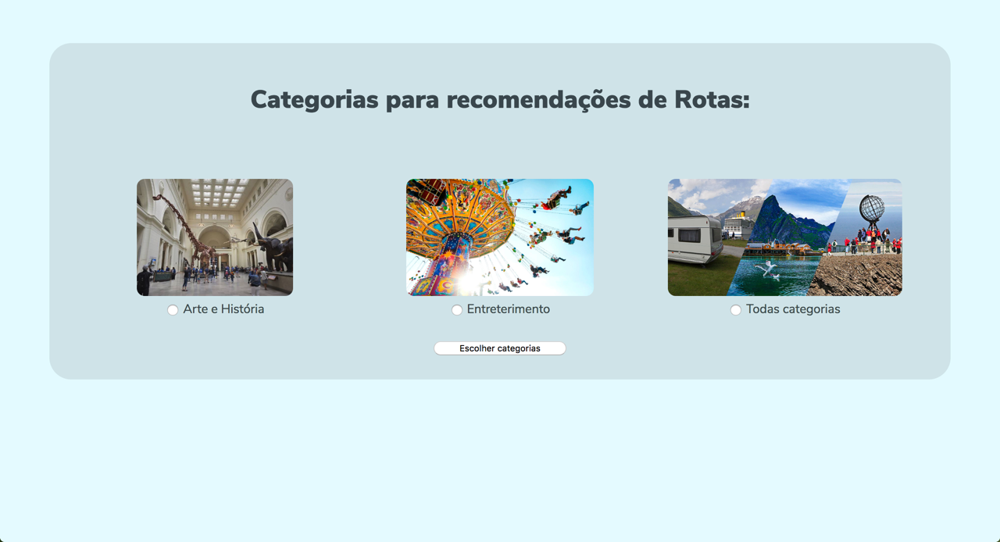
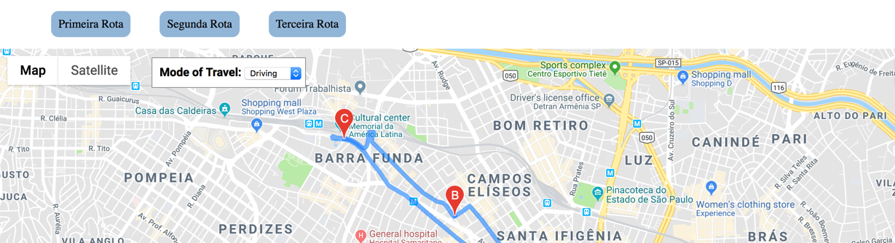

# Entrega 3

## Principais entregas

#### Melhorar a escolha de quais categorias buscar através de informações do usuário

Com objetivo de gerar rotas para o usuário com maior rapidez foi levantada possibilidade de utilizar informações do usuário associadas
a sua conta do Gmail. No entanto as únicas informações que podem ser obtidas através da API do Google não estão correlacionadas ao
Google Maps ou qualquer avaliação de localidade.

Outras soluções foram ponderadas como:

- Utilizar o Graph API do Facebook com objetivo de usar os checkins dos usuários como forma de realizar as melhores indicações.
No entanto o endpoint que trazia essas informações foi depreciado.

- Utilizar o serviço de localidade da [FourSquare](https://enterprise.foursquare.com/products/places) utilizado pelo Uber, Airbnb e a Samsung.
No entanto eles possuem apenas plano empresarial, logo foi descartado.

Devido aos empedimentos encontrados foram implementadas opções para o usuário escolher as categorias ao invés das mesmas serem recomendadas automaticamente,
em uma etapa futura essa e outras opçãos podem ser detectadas automaticamente com base no perfil do usuária.
Foram criadas duas categorias macro: arte e história, e entreterimento. Essas duas divisões agrupam categorias em dois blocos.
As modificações para tal foram feitas [aqui](poi/OverlayData.py)

Categoria Arte e História:

```

'["amenity"="arts_centre"]', 'type': 'arts_centre'
'["tourism"="gallery"]', 'type': 'gallery'
'["tourism"="artwork"][artwork_type!~"statue"]', 'type': 'artwork'
'["historic"~"^monument$|^memorial$"]', 'type': 'monument_memorial'
'["tourism"="museum"]', 'type': 'museum'
'["historic"="statue"]', 'type': 'statue'
'["historic"][historic!~"memorial|monument|statue|castle"]', 'type': 'historic'

```

Categoria Entreterimento:

```

'["tourism"="attraction"]', 'type': 'attraction'
'["tourism"="information"]', 'type': 'information'
'["tourism"="theme_park"]', 'type': 'theme_park'
'["tourism"="viewpoint"]', 'type': 'viewpoint'
'["tourism"="zoo"]', 'type': 'zoo'
'["leisure"="casino"]', 'type': 'casino'
'["leisure"="gastro"]', 'type': 'gastro'
'["tourism"="picnic_site"]', 'type': 'picnic'

```

Agora há uma [página](templates/chooseCategory.html) na qual o usuário escolhe para qual categoria deseja gerar as recomendações de rotas.

Tela de escolha de categoria:


Tela de carregamento da consulta de dados e geração de recomendações:


#### Links das recomendações de rotas geradas

As rotas geradas a partir da recomendação eram renderizadas em diferentes abas do navegador. Com objetivo de melhorar a
usabilidade todas as rotas agora são renderizadas em uma mesma aba e é possível navegar através do menu localizado no topo.
Para isso foi modificado o [template](routes/route_sample.html) utilizado para gerar as rotas e a [chamada/renderização](route/Route.py) das páginas.
Menu de rotas adicionados:


#### Analizar o Precision and Recall após tais mudanças

Foram feitas alterações nas categorias que geravam dados para as recomendações. A analize do Precision e Recall trouxe
os seguintes dados:

- Resultados antes:

Precision and recall summary statistics by cutoff
```

+--------+-----------------+----------------+
| cutoff |  mean_precision |  mean_recall   |
+--------+-----------------+----------------+
|   1    |  0.111111111111 | 0.111111111111 |
|   2    | 0.0555555555556 | 0.111111111111 |
|   3    | 0.0925925925926 | 0.277777777778 |
|   4    | 0.0694444444444 | 0.277777777778 |
|   5    | 0.0666666666667 | 0.333333333333 |
|   6    | 0.0740740740741 | 0.444444444444 |
|   7    | 0.0634920634921 | 0.444444444444 |
|   8    | 0.0694444444444 | 0.555555555556 |
|   9    | 0.0740740740741 | 0.666666666667 |
|   10   | 0.0666666666667 | 0.666666666667 |
+--------+-----------------+----------------+

```
[10 rows x 3 columns]

('\nOverall RMSE: ', 0.5553332888711022)

- Resultado após divisão de categorias (resultado gerado para categorias englobadas em 'Arte e História'):

Precision and recall summary statistics by cutoff
```

+--------+----------------+----------------+
| cutoff | mean_precision |  mean_recall   |
+--------+----------------+----------------+
|   1    | 0.333333333333 | 0.333333333333 |
|   2    |      0.25      |      0.5       |
|   3    | 0.277777777778 | 0.833333333333 |
|   4    | 0.208333333333 | 0.833333333333 |
|   5    |      0.2       |      1.0       |
|   6    |      0.2       |      1.0       |
|   7    |      0.2       |      1.0       |
|   8    |      0.2       |      1.0       |
|   9    |      0.2       |      1.0       |
|   10   |      0.2       |      1.0       |
+--------+----------------+----------------+

```
[10 rows x 3 columns]

('\nOverall RMSE: ', 0.8461240605998189)


- Resultado após divisão de categorias (resultado gerado para categorias englobadas em 'Entreterimento'):

Precision and recall summary statistics by cutoff
```

+--------+-----------------+----------------+
| cutoff |  mean_precision |  mean_recall   |
+--------+-----------------+----------------+
|   1    |  0.111111111111 | 0.111111111111 |
|   2    | 0.0555555555556 | 0.111111111111 |
|   3    | 0.0925925925926 | 0.277777777778 |
|   4    | 0.0833333333333 | 0.333333333333 |
|   5    |       0.1       |      0.5       |
|   6    | 0.0925925925926 | 0.555555555556 |
|   7    | 0.0873015873016 | 0.611111111111 |
|   8    | 0.0902777777778 | 0.722222222222 |
|   9    | 0.0802469135802 | 0.722222222222 |
|   10   | 0.0777777777778 | 0.777777777778 |
+--------+-----------------+----------------+

```
[10 rows x 3 columns]

('\nOverall RMSE: ', 0.5259764581879129)


Como pode ser observado nos valores acima, apesar de haver uma melhora nos numéros de Precision e Recall dos itens gerados pela
recomendação após as modificações das categorias, o RMSE aumentou consideravelmente para uma das categorias.
Logo mostrou-se necessário um maior estudo a respeito dos valores estatísticos gerados pela biblioteca de recomendação para o melhor entendimento
de suas funcionalidades. 
Uma das possíveis razões para a diferença, pode está relacionada a base de avaliações por localidade, como a API do Google é limitada em relação a quantidade de informações fornecida, não é possível ter alta confiabilidade nos resultados gerados.

## Próximos passos

- Trazer relatórios mais detalhados sobre as estatísticas geradas pelas recomendações com um melhor embasamento teórico

- Estudar utilização de banco de dados da Yelp para maior avaliações dos pontos turísticos (ou outras fontes)

Após analize dos resultados de Precision e Recall relacionado ao resultado do RMSE, foi identificado a necessidade de obter
mais dados para melhor treinar as recomendações. Esse ponto deve ser tratado como prioridade.

- Implementar login do usuário

Possibilitar que o usuário possa ter uma conta para que seja possível coleta de informações de cada usuário.
A partir do login é possível:

    - Sugerir a categoria a ser recomendada a partir de suas escolhas previas
    - Adicionar botão de escolha da rota (para saber se o usuário decidiu ir pela aquela rota ou não)
    - Avaliação da Rota oferecida

- Mostrar o nome da localidade no mapa

Atualmente no mapa aparece apenas o endereço do ponto, seria interessante trazer o nome da localidade

- Adicionar campo para que o usuário entre com sua localização atual e opcionalmente um destino

- Analisar possíveis melhoras na _Serendipity_ do algoritimo (Item mencionado anteriormente)

Após disponível a geração da recomendação para qualquer lugar foi observado que uma recomendação gerada para um bairro poderia não ter insumo suficiente dentre as categorias selecionadas para gerar a recomendação da forma que está implementada.
O Serendipity, permite que o resultado de uma busca possa retornar sugestões de outros itens.
