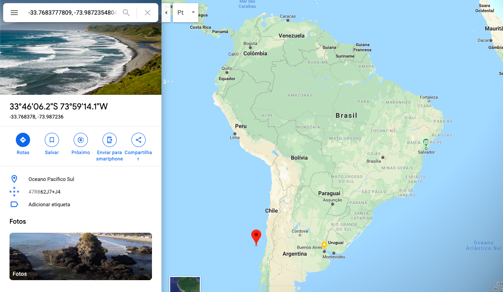

# Entrega 3

## Principal entrega

Todas as informações de usuários, poi's e reviews são provenientes da API do Google,
é de conhecimento que há uma limitação na obtenção de dados através dessa API.

Como foi observado na entrega passada a quantidade de informações se mostrou insuficiente para obtenção de resultados satisfatórios e números estatísticos condizentes.

### Nova base de dados públicos:

Essa última entrega foi trabalhada em cima da base de reviews encontrada. A base contém informações de reviews, usuários e items(lugares) extraídas do Google Local (Google Maps), possuindo um total de:

```

Reviews:	11,453,845
Users:	4,567,431
Businesses:	3,116,785

```

A base foi encontrada nesse [site](http://cseweb.ucsd.edu/~jmcauley/datasets.html#google_local) no qual é possível checar a procedência dos dados
através dos papers citados.

#### Filtragem da base

Foi necessário filtrar a base por lugares situados no Brasil, com o objetivo de melhorar o tempo de processamento das informações. Para isso foi utilizada uma bounding box para determinar quais informações de latitude e longitude pertenciam ao Brasil. Foram utilizadas duas geolocalizações que cobrem o país como um todo:

Localização superior:


Localização inferior:



Obtendo assim reviews, usuários e locais referentes ao Brasil. É possível encontrar algumas localidades que não são referentes ao Brasil e sim aos países próximos devido a bounding box ser quadrada, no entanto esse número se mostrou muito baixo.

É possível encontrar o código utilizado para essa manipulação de dados [aqui](data/data_filter.py) contendo toda interação necessária para filtragem dos 3 arquivos.

Lógica muito semelhante à utilizada para filtrar dados de São Paulo (cidade escolhida para teste) já que as recomendações, a priori, são feitas com base nas informações de uma cidade. O arquivo para essa filtragem encontra-se [aqui](data/data_filter_sp.py)

#### Conversão dos dados

Após a filtragem dos dados foi necessário converter os arquivos para o formato esperado pelo algorítimo de recomendação. [Esse](data/covert_file_poi.py) arquivo contém a lógica utilizada para geração dos arquivos no formato necessário.

#### Testes com a nova base

- Foi possível notar que as recomendações geradas para a nova base trouxeram resultados melhores em alguns aspectos como diferentes indicações para diferentes usuários, pois há uma quantidade maior de informações sobre as preferências daquele usuário.

- No entanto ainda é necessário mais testes, para que se tenha certeza dos números encontrados.

Por exemplo, foram observados valores muito bons de Precision e Recall, mas o RMSE permaneceu apresentando valores pouco desejáveis, para os testes utilizando a implementação da forma como estava.

Testes com estruturação diferente do frame de dados utilizado pela biblioteca de recomendação como a opção de [FactorizationRecommender](https://turi.com/products/create/docs/generated/graphlab.recommender.factorization_recommender.FactorizationRecommender.html#graphlab.recommender.factorization_recommender.FactorizationRecommender) trouxeram ótimos valores de RMSE, no entanto ainda é necessário uma melhor análise da lógica de recomendação para ter certeza de que esse é o melhor algorítimo.

## Próximos passos

- Gerar dados em cima da nova base a fim de encontrar uma implementação da recomendação com valores esperados de erro.

- Incluir as categorias (presentes nos reviews) nos itens de pois para que seja possível utilizar essas informações da mesma forma que era utilizado previamente.

Para isso é necessário normalizar as categorias presentes nos reviews e adiciona-las aos seus pois correspondentes.
