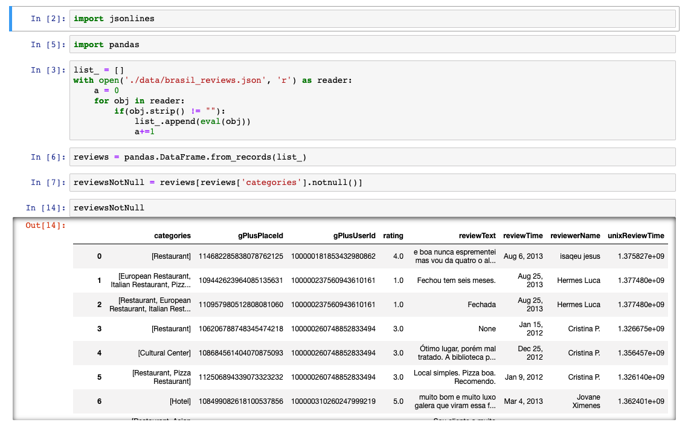
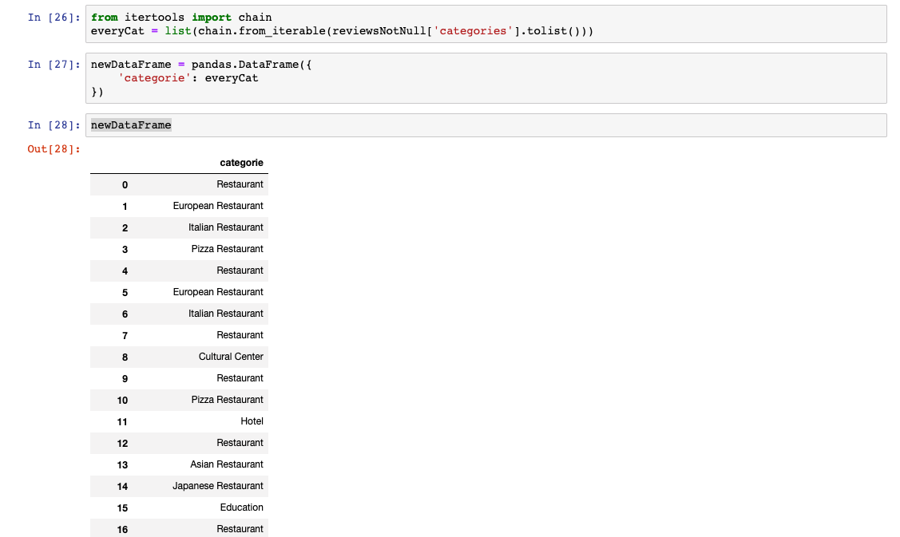
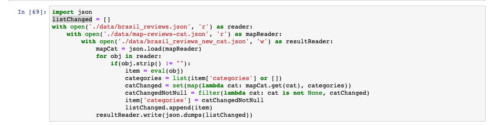

# Entrega - Correção de Dataset

# Objetivo da entrega

O Dataset com dados expressivos possuia os itens - poi's - com categorias não normalizadas.
Foi necessário normalizar essa informoção para utilizar as categorias como filtro e de forma 
relevante na recomendação.

# Passos normalização

Foi utilizada a ferramenta [Jupter](https://jupyter.org/). Todo o código gerado encontra-se no [arquivo](reviews-categories.ipynb)

## Listar reviews sem categorias nulas

Os reviews sem categoria nula totalizam: 205953

## Quebrando as listas

Os reviews possuiam uma lista de categorias, foi necessário quebralas para obter a lista de 
todas as categorias existentes.

## Principais categorias

Foi necessário aglutinar as categorias e ordenalas por quantidade. As categorias com mais de 100
aparições foram selecionadas resultando em:

- Total de categorias únicas: 2957
- Total de categorias únicas com mais de 100 aparições: 256

## Arquivo de mapeamento

Basedo na lista gerada no passo acima das categorias com mais de 100 aparições, foi feito um [arquivo](data/map-reviews-cat.json) de mapeamento dessas categorias para suas equivalências normalizadas. 

## Aplicando alterações no arquivo de reviews

Para adicionar as categorias normalizadas no arquivo de reviews:

